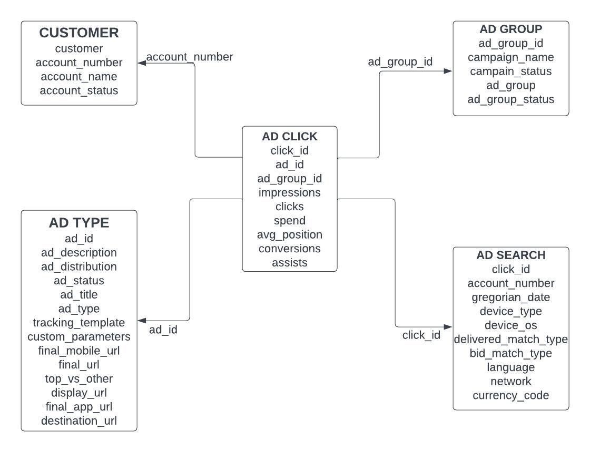
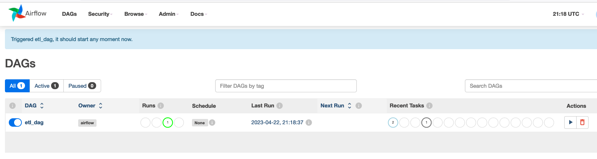

# ads-etl
## What does it do?
This repo serves as an example of an ETL pipeline that uses PostgresSQL database and Airflow scheduler. The sample data is included inside `dags/app` directory. The ETL job extracts data from the csv file, process and then load the respective tables into PostgresSQL.

## Schema Design

The below star schema shows how the data is broken into 5 different tables. Each dimension table is linked to the fact table by their foreign keys. The extra serial primary key is created for the ad search and ad click table.



## Installation

[Docker](https://www.docker.com/) is needed to run this repo.
Airflow installation through `docker-compose.yaml` could be found from Marvin's [guide](https://towardsdatascience.com/setting-up-apache-airflow-with-docker-compose-in-5-minutes-56a1110f4122) and 
the Airflow's [webiste](https://airflow.apache.org/docs/apache-airflow/stable/howto/docker-compose/index.html).

To install the image, simply run ```docker-compose up -d``` inside the working directory. Package requirements could be specified in the requirement.txt file. For this app, we don't really need any external packages installed.

Once the installation is finished, you could log into your `localhost` database with port `5434` by using the following credential. They could also be found in the `.env` file.
```
POSTGRES_USER=airflow
POSTGRES_PASSWORD=airflow
POSTGRES_DB=airflow
```

Navigate to your web browser and enter `http://localhost:8080` to access Airflow UI. The username and the password is `airflow`.



You should see an etl_dag as in the picture. Trigger the dag to start the ETL pipeline. After the dag is finished, navigate to your PostgresSQL database and look for a schema name etl. This schema should contain all of the tables.
